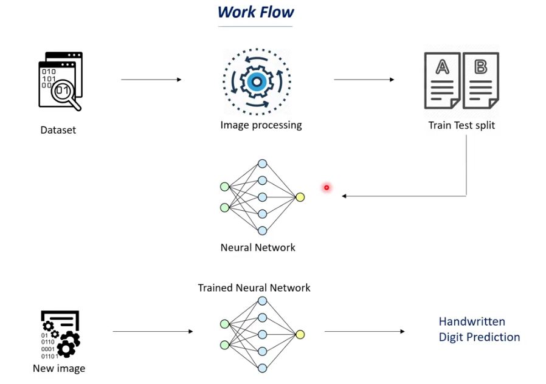

# 🔢 Handwritten Digit Recognition — Neural Network

A deep learning project that classifies handwritten digits (0–9) using a fully connected neural network trained on the MNIST dataset. The model learns to recognize digit patterns from 28×28 grayscale images and can predict digits from real-world input images using OpenCV.

---

## 🔄 Workflow

<p align="center">
  
</p>

| Step | Description |
|------|-------------|
| 📥 Load Data | Load MNIST dataset (60,000 train / 10,000 test images) |
| 🔍 Explore Data | Visualize sample images, check shapes, inspect pixel values |
| ⚖️ Normalize | Scale pixel values from [0, 255] to [0, 1] |
| 🏗️ Build Model | Sequential neural network with 3 Dense layers + Dropout |
| 🎯 Train Model | Train for 15 epochs with validation split |
| 📈 Visualize | Plot accuracy and loss curves for train vs validation |
| 🧪 Evaluate | Measure test loss and accuracy on held-out test set |
| 🗺️ Confusion Matrix | Heatmap showing per-class prediction performance |
| 🔮 Predict | Load real image → preprocess → classify digit |

---

## 🛠️ Tech Stack


---

## 🤖 How the Model Works

The model is a **feedforward neural network (MLP)** — the same family as the breast cancer project, but now extended to **multi-class classification** across 10 digit categories instead of just 2.

The key differences from binary classification:

- **Flatten layer** → converts each 28×28 image into a flat vector of 784 values so Dense layers can process it
- **ReLU activation** in hidden layers → learns complex non-linear patterns in pixel data
- **Dropout** → prevents overfitting by randomly switching off neurons during training
- **Softmax activation** in output → produces 10 probabilities, one per digit, that sum to 1
- **Sparse Categorical Crossentropy** → correct loss for multi-class problems where labels are integers (not one-hot encoded)
- **`np.argmax()`** → picks the digit class with the highest probability as the final prediction

The real-world prediction pipeline adds an extra preprocessing stage using **OpenCV**: the input image is converted to grayscale, resized to 28×28 to match the training format, scaled to [0, 1], and reshaped before being passed to the model.

---

## 📁 Project Structure

```
mnist-digit-recognition/
│
├── mnist_classification.py   # Full pipeline script
├── image_test.png            # Sample image for real-world prediction
├── README.md                 # Project documentation
└── requirements.txt          # Python dependencies
```

---

## 📊 Results

| Metric | Score |
|--------|-------|
| Training Accuracy | 98% |
| Validation Accuracy | 98% |
| Test Accuracy | 97.8% |
| Test Loss | 0.08 |

> The confusion matrix provides a detailed breakdown of correct vs incorrect predictions per digit class (0–9).